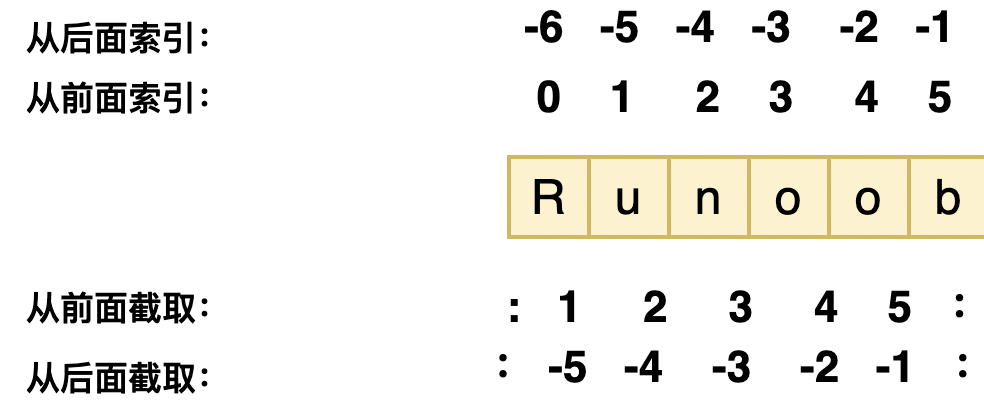
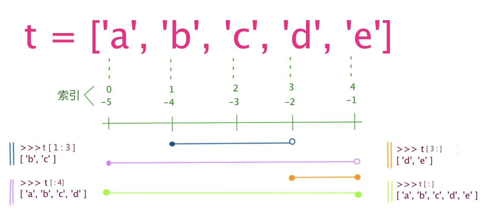
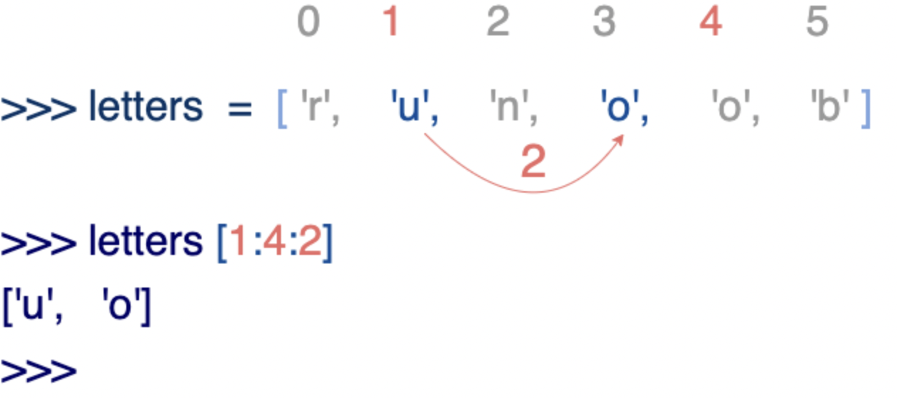

> 在 Python 中，变量就是变量，它没有类型，我们所说的"类型"是**变量所指的内存中对象的类型**

## 变量在使用前必须赋值，变量赋值以后该变量才会被创建

```python
counter = 100          # 整型变量
miles   = 1000.0       # 浮点型变量
name    = "runoob"     # 字符串
```

## 多个变量赋值

```python
a = b = c = 1 # 三个变量被赋予相同的数值
a, b, c = 1, 2, "runoob" # 两个整型对象 1 和 2 的分配给变量 a 和 b，字符串对象 "runoob" 分配给变量 c
```

### 变量和对象之间的关系

- 赋值操作，本质是创建引用
- 变量是变量，对象是对象，当将某个对象赋值给某个变量时，可以认为是创建了变量对该对象的引用
- 变量没有数据类型之说，只有对象有，即变量不是直接代表对象或对象占用的内存空间
- Python中，变量无需提前声明，无需指定其数据类型，其表现完全是动态的，其所为的数据类型决定于当前该变量所引用的对象的数据类型
- 所谓变量对对象的引用，本质是创建了变量指向对象内存空间的指针
- 对象内存空间，一般最起码有类型和当前被引用次数这两个信息，类型记录了该对象的数据类型，被引用次数记录了该对象内存空间被变量引用的次数
- 当某对象的被引用次数为0时，Python便会自动回收该对象内存空间

比如下面的

```python
a=10
a='122'
a=[1,2,3]
del a
```

此时，a在不同的赋值代码行中，引用的对象类型不同，相当于在不断改变a引用的对象，最后当把a变量删除时，其实本质只是删除了a变量名，但由于a引用的[1,2,3]对象，因为a被删除，其被引用次数变为0，也就自动被Python回收，最终表现就是del a时，[1,2,3]也被删除了。

另外一个小知识是，Python为提升代码执行和内存分配效率，会对一些常用的对象提前创建好，并常驻内存，比如下面：

```python
id(4) #不管运行多少次该代码，其返回的值均不变，因为python会保持一些常用的数字常驻内存，不会每次都重新分配内存空间
id('hello world') #每次运行，返回的值均会发生变化，因为每次运行，相当于都在重新分配内存空间
```

## 标准数据类型

### 1. Number（数字）(**不可变数据**)

>  Python3 支持 **int、float、bool、complex（复数）**
>
> **complex** 可以用a + bj,或者complex(a,b)表示， 复数的实部a和虚部b都是浮点型

```python
>>> 5 + 4  # 加法
9
>>> 4.3 - 2 # 减法
2.3
>>> 3 * 7  # 乘法
21
>>> 2 / 4  # 除法，得到一个浮点数
0.5
>>> 2 // 4 # 除法，得到一个整数
0
>>> 17 % 3 # 取余
2
>>> 2 ** 5 # 乘方
32
```

**注意：** 在混合计算时，Python会把整型转换成为浮点数

| int    | float      | complex    |
| :----- | :--------- | :--------- |
| 10     | 0.0        | 3.14j      |
| 100    | 15.20      | 45.j       |
| -786   | -21.9      | 9.322e-36j |
| 080    | 32.3e+18   | .876j      |
| -0490  | -90.       | -.6545+0J  |
| -0x260 | -32.54e100 | 3e+26J     |
| 0x69   | 70.2E-12   | 4.53e-7j   |

#### type() 函数、isinstance()函数 判断类型

> 用来查询变量所指的对象类型

```python
a, b, c, d = 20, 5.5, True, 4+3j
print(type(a), type(b), type(c), type(d))
'''输出值：<type 'int'>, <type 'float'>, <type 'bool'>, <type 'complex'> '''
```

```python
isinstance(a, int)
'''输出值：True '''
```

**区别：**

- **type()** 不会认为子类是一种父类类型
- **isinstance()** 会认为子类是一种父类类型

```python
>>> class A:
...     pass
... 
>>> class B(A):
...     pass
... 
>>> isinstance(A(), A)
True
>>> type(A()) == A 
True
>>> isinstance(B(), A)
True
>>> type(B()) == A
False
```

#### issubclass()函数、is函数

**注意：** *Python3 中，**bool 是 int 的子类**，**True 和 False 可以和数字相加**，* **True==1、False==0** *会返回* **True***，但可以通过* **is** *来判断类型*

```python
>>> issubclass(bool, int) 
True
>>> True==1
True
>>> False==0
True
>>> True+1
2
>>> False+1
1
>>> 1 is True
False
>>> 0 is False
False
```

#### del 语句删除被创建对象的引用

```python
# 删除单个或多个对象
del var
del var_a, var_b
```

#### bool

> Python 中布尔值使用常量 **True** 和 **False** 来表示。

1、在数值上下文环境中，**True** 被当作 **1**，**False** 被当作 **0**，例如：

```python
>>> True+3
4
>>> False+2
2
```

2、其他类型值转换 **bool** 值时除了 **''、""、''''''、""""""、0、()、[]、{}、None、0.0、0L、0.0+0.0j、False** 为 **False** 外，其他都为 **True** 例如：

```python
>>> bool(-2)
True
>>> bool('')
False
```

#### complex复数

```Python
#coding=utf8  
''''' 
复数是由一个实数和一个虚数组合构成，表示为：x+yj 
一个负数时一对有序浮点数(x,y)，其中x是实数部分，y是虚数部分。 
Python语言中有关负数的概念： 
1、虚数不能单独存在，它们总是和一个值为0.0的实数部分一起构成一个复数 
2、复数由实数部分和虚数部分构成 
3、表示虚数的语法：real+imagej 
4、实数部分和虚数部分都是浮点数 
5、虚数部分必须有后缀j或J 
 
复数的内建属性： 
复数对象拥有数据属性，分别为该复数的实部和虚部。 
复数还拥有conjugate方法，调用它可以返回该复数的共轭复数对象。 
复数属性：real(复数的实部)、imag(复数的虚部)、conjugate()（返回复数的共轭复数） 
'''  
class Complex(object):  
    '''''创建一个静态属性用来记录类版本号'''  
    version=1.0  
    '''''创建个复数类，用于操作和初始化复数'''  
    def __init__(self,rel=15,img=15j):  
        self.realPart=rel  
        self.imagPart=img  
         
    #创建复数  
    def creatComplex(self):  
        return self.realPart+self.imagPart  
    #获取输入数字部分的虚部  
    def getImg(self):  
        #把虚部转换成字符串  
        img=str(self.imagPart)  
        #对字符串进行切片操作获取数字部分  
        img=img[:-1]   
        return float(img)    
                         
def test():  
    print "run test..........."  
    com=Complex()  
    Cplex= com.creatComplex()  
    if Cplex.imag==com.getImg():  
        print com.getImg()  
    else:  
        pass  
    if Cplex.real==com.realPart:  
        print com.realPart  
    else:  
        pass  
    #原复数  
    print "the religion complex is :",Cplex  
    #求取共轭复数  
    print "the conjugate complex is :",Cplex.conjugate()  
      
if __name__=="__main__":  
    test()
```

### 2. String（字符串）(**不可变数据**)

> 字符串用单引号 **'** 或双引号 **"** 括起来，同时使用反斜杠  \ 转义特殊字符

字符串的截取的语法格式如下：

```
变量[头下标:尾下标]
```

索引值以 0 为开始值，-1 为从末尾的开始位置。



加号 **+** 是字符串的连接符， 星号 ***** 表示复制当前字符串，与之结合的数字为复制的次数。实例如下：

```python
#!/usr/bin/python3

str = 'Runoob'
print(str)      # 输出字符串
print(str[0:-1])   # 输出第一个到倒数第二个的所有字符
print(str[0])    # 输出字符串第一个字符
print(str[2:5])   # 输出从第三个开始到第五个的字符
print(str[2:])    # 输出从第三个开始的后的所有字符
print(str * 2)    # 输出字符串两次，也可以写成 print (2 * str)
print(str + "TEST") # 连接字符串
```

#### \ 转义

```python
print('Ru\noob') # 转义
Ru
oob
print(r'Ru\noob') # 不转义
Ru\noob
```

### 3. List（列表）(**可变数据**)

> 列表中元素的类型可以不相同，它支持数字，字符串甚至可以包含列表（所谓嵌套）
>
> 列表是写在方括号 **[]** 之间、用逗号分隔开的元素列表

列表截取的语法格式如下：

```
变量[头下标:尾下标]
```

索引值以 **0** 为开始值，**-1** 为从末尾的开始位置。



加号 **+** 是列表连接运算符，星号 ***** 是重复操作。如下实例：

```python
list = [ 'abcd', 786 , 2.23, 'runoob', 70.2 ]
tinylist = [123, 'runoob']

print (list)            # 输出完整列表 >> ['abcd', 786, 2.23, 'runoob', 70.2]
print (list[0])         # 输出列表第一个元素 >> abcd
print (list[1:3])       # 从第二个开始输出到第三个元素 >> [786, 2.23]
print (list[2:])        # 输出从第三个元素开始的所有元素 >> [2.23, 'runoob', 70.2]
print (tinylist * 2)    # 输出两次列表 >> [123, 'runoob', 123, 'runoob']
print (list + tinylist) # 连接列表 >> ['abcd', 786, 2.23, 'runoob', 70.2, 123, 'runoob']
```

列表中的元素是可以改变的：

```python
>>> a = [1, 2, 3, 4, 5, 6]
>>> a[0] = 9
>>> a[2:5] = [13, 14, 15]
>>> a
[9, 2, 13, 14, 15, 6]
>>> a[2:5] = []   # 将对应的元素值设置为 []
>>> a
[9, 2, 6]
```

列表截取可以接收第三个参数，参数作用是截取的步长，以下实例在索引 1 到索引 4 的位置并设置为步长为 2（间隔一个位置）来截取字符串：



如果第三个参数为负数表示逆向读取，以下实例用于翻转字符串：

```python
def reverseWords(input):
     
    # 通过空格将字符串分隔符，把各个单词分隔为列表
    inputWords = input.split(" ")
 
    # 翻转字符串
    # 假设列表 list = [1,2,3,4],  
    # list[0]=1, list[1]=2 ，而 -1 表示最后一个元素 list[-1]=4 ( 与 list[3]=4 一样)
    # inputWords[-1::-1] 有三个参数
    # 第一个参数 -1 表示最后一个元素
    # 第二个参数为空，表示移动到列表末尾
    # 第三个参数为步长，-1 表示逆向
    inputWords=inputWords[-1::-1]
 
    # 重新组合字符串
    output = ' '.join(inputWords)
     
    return output
 
if __name__ == "__main__":
    input = 'I like runoob'
    rw = reverseWords(input)
    print(rw) # >>> runoob like I
```

### 4. Tuple（元组）(**不可变数据**)

> 元组（tuple）与列表类似，不同之处在于元组的元素不能修改。元组写在小括号 **()** 里，元素之间用逗号隔开。

元组中的元素类型也可以不相同：

```python
tuple = ( 'abcd', 786 , 2.23, 'runoob', 70.2  )
tinytuple = (123, 'runoob')

print (tuple)             # 输出完整元组
print (tuple[0])          # 输出元组的第一个元素
print (tuple[1:3])        # 输出从第二个元素开始到第三个元素
print (tuple[2:])         # 输出从第三个元素开始的所有元素
print (tinytuple * 2)     # 输出两次元组
print (tuple + tinytuple) # 连接元组
```

虽然**tuple的元素不可改变，但它可以包含可变的对象，比如list列表**。

构造包含 0 个或 1 个元素的元组比较特殊，所以有一些额外的语法规则：

```python
tup1 = ()    # 空元组
tup2 = (20,) # 一个元素，需要在元素后添加逗号
```

### 5. Set（集合）(**可变数据**)

基本功能是进行**成员关系测试**和**删除重复元素**。

可以使用大括号 **{ }** 或者 **set()** 函数创建集合，注意：创建一个空集合必须用 **set()** 而不是 **{ }**，因为 **{ }** 是用来创建一个空字典。

创建格式：

```python
parame = {value01,value02,...}
或者
set(value)
```

```python
sites = {'Google', 'Taobao', 'Runoob', 'Facebook', 'Zhihu', 'Baidu'}
print(sites)   # 输出集合，重复的元素被自动去掉 >>> {'Zhihu', 'Baidu', 'Taobao', 'Runoob', 'Google', 'Facebook'}

# 成员测试
if 'Runoob' in sites :
    print('Runoob 在集合中')
else :
    print('Runoob 不在集合中')

# set可以进行集合运算
a = set('abracadabra')
b = set('alacazam')

print(a) # >>> {'b', 'c', 'a', 'r', 'd'}
print(a - b)     # a 和 b 的差集 >>> {'r', 'b', 'd'}
print(a | b)     # a 和 b 的并集 >>> {'b', 'c', 'a', 'z', 'm', 'r', 'l', 'd'}
print(a & b)     # a 和 b 的交集 >>> {'c', 'a'}
print(a ^ b)     # a 和 b 中不同时存在的元素 >>> {'z', 'b', 'm', 'r', 'l', 'd'}
```

### 6. Dictionary（字典）(**可变数据**)

```python
dict = {}
dict['one'] = "1 - 菜鸟教程"
dict[2]     = "2 - 菜鸟工具"

tinydict = {'name': 'runoob','code':1, 'site': 'www.runoob.com'}

print (dict['one'])       # 输出键为 'one' 的值 >>> 1 - 菜鸟教程
print (dict[2])           # 输出键为 2 的值 >>> 2 - 菜鸟工具
print (tinydict)          # 输出完整的字典 >>> {'name': 'runoob', 'code': 1, 'site': 'www.runoob.com'}
print (tinydict.keys())   # 输出所有键 >>> ['code', 'name', 'site']
print (tinydict.values()) # 输出所有值 >>> [1, 'runoob', 'www.runoob.com']
```

#### 构造函数 dict()

直接从键值对序列中构建字典如下：

```python
>>> dict_1 = dict([('a',1),('b',2),('c',3)]) # 元素为元组的列表
>>> dict_1
{'a': 1, 'b': 2, 'c': 3}
>>> dict_2 = dict({('a',1),('b',2),('c',3)}) # 元素为元组的集合
>>> dict_2
{'b': 2, 'c': 3, 'a': 1}
>>> dict_3 = dict([['a',1],['b',2],['c',3]]) # 元素为列表的列表
>>> dict_3
{'a': 1, 'b': 2, 'c': 3}
>>> dict_4 = dict((('a',1),('b',2),('c',3))) # 元素为元组的元组
>>> dict_4
{'a': 1, 'b': 2, 'c': 3}

>>> {x: x**2 for x in (2, 4, 6)}
{2: 4, 4: 16, 6: 36}
>>> dict(Runoob=1, Google=2, Taobao=3)
{'Runoob': 1, 'Google': 2, 'Taobao': 3}
```

另外，字典类型也有一些内置的函数，例如clear()、keys()、values()等。

**注意：**

- 1、字典是一种映射类型，它的元素是键值对。
- 2、字典的关键字必须为不可变类型，且不能重复。
- 3、创建空字典使用 **{ }**。

#### items()函数

输入 dict 的键值对，可直接用 **items()** 函数：

```python
dict1 = {'abc':1,"cde":2,"d":4,"c":567,"d":"key1"}
for k,v in dict1.items():
    print(k,":",v)
```

#### 字典推导式

```Python
# 字典推导式
p = {i:str(i) for i in range(1,5)}
print("p:",p)
'''
p: {1: '1', 2: '2', 3: '3', 4: '4'}
'''

x = ['A','B','C','D']
y = ['a','b','c','d']
n = {i:j for i,j in zip(x,y)}
print("n:",n)
'''
n: {'A': 'a', 'B': 'b', 'C': 'c', 'D': 'd'}
'''

s = {x:x.strip() for x in ('he','she','I')}
print("s:",s)
'''
s: {'he': 'he', 'she': 'she', 'I': 'I'}
'''
```

## Python数据类型转换

> 只需要将数据类型作为函数名即可

| 函数                                                         | 描述                                                |
| :----------------------------------------------------------- | :-------------------------------------------------- |
| [int(x [,base\])](https://www.runoob.com/python3/python-func-int.html) | 将x转换为一个整数                                   |
| [float(x)](https://www.runoob.com/python3/python-func-float.html) | 将x转换到一个浮点数                                 |
| [complex(real [,imag\])](https://www.runoob.com/python3/python-func-complex.html) | 创建一个复数                                        |
| [str(x)](https://www.runoob.com/python3/python-func-str.html) | 将对象 x 转换为字符串                               |
| [repr(x)](https://www.runoob.com/python3/python-func-repr.html) | 将对象 x 转换为表达式字符串                         |
| [eval(str)](https://www.runoob.com/python3/python-func-eval.html) | 用来计算在字符串中的有效Python表达式,并返回一个对象 |
| [tuple(s)](https://www.runoob.com/python3/python3-func-tuple.html) | 将序列 s 转换为一个元组                             |
| [list(s)](https://www.runoob.com/python3/python3-att-list-list.html) | 将序列 s 转换为一个列表                             |
| [set(s)](https://www.runoob.com/python3/python-func-set.html) | 转换为可变集合                                      |
| [dict(d)](https://www.runoob.com/python3/python-func-dict.html) | 创建一个字典。d 必须是一个 (key, value)元组序列。   |
| [frozenset(s)](https://www.runoob.com/python3/python-func-frozenset.html) | 转换为不可变集合                                    |
| [chr(x)](https://www.runoob.com/python3/python-func-chr.html) | 将一个整数转换为一个字符                            |
| [ord(x)](https://www.runoob.com/python3/python-func-ord.html) | 将一个字符转换为它的整数值                          |
| [hex(x)](https://www.runoob.com/python3/python-func-hex.html) | 将一个整数转换为一个十六进制字符串                  |
| [oct(x)](https://www.runoob.com/python3/python-func-oct.html) | 将一个整数转换为一个八进制字符串                    |

